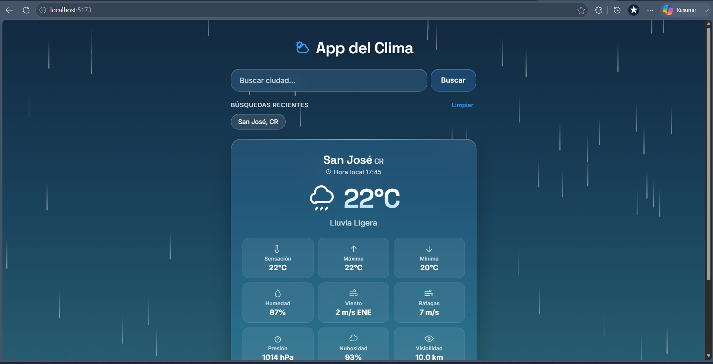
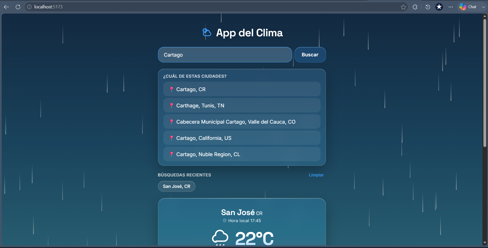
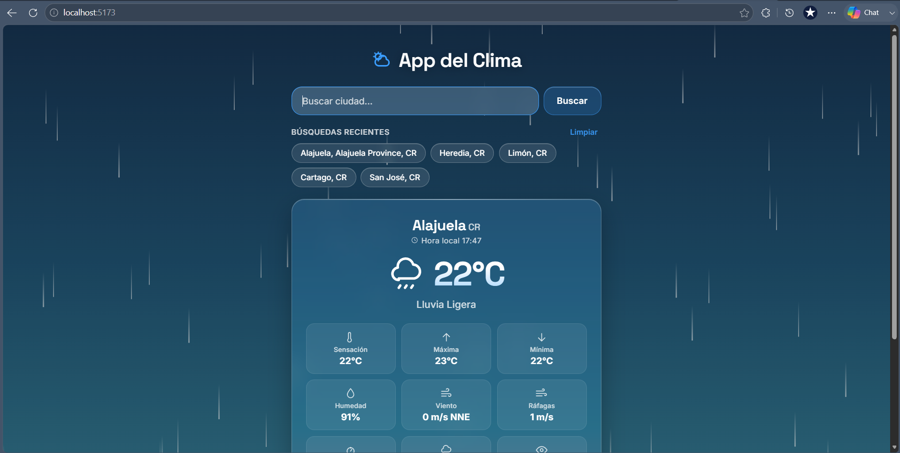
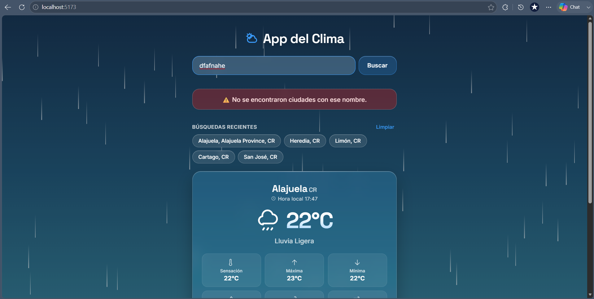
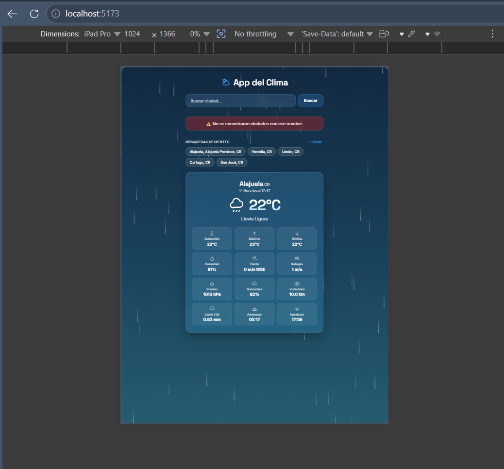

# App del Clima — React 19

Aplicación web que permite buscar el clima actual de cualquier ciudad del mundo, usando la API de OpenWeatherMap, investigación desarrollada para el curso IF7102: Multimedios, como parte de la investigación aplicada de frameworks frontend — Grupo asignado a **React 19**.

## Integrantes

- B81903 Daniel Cavalari Solano
- C34880 Yuridia Mendoza Rodriguez
- C34386 Alison Lopez Reyes
- C31386 Nathalie Caballero Jarquin
- C31114 Naillel Bermudez Romero

## Demo en línea

PENDIENTE

## Framework usado

**React 19** con:
- **Vite** como bundler y servidor de desarrollo
- CSS plano (sin librerías de componentes UI)

## Instalación local

1. Clonar el repositorio:
```bash
   git clone https://github.com/Cavalari2599/ProyectoGrupal.git     ARREGLAR!!!!
   cd ProyectoGrupal
```

2. Instalar dependencias:
```bash
   pnpm install
```

3. Configurar la API Key (ver sección de abajo).

4. Levantar el servidor de desarrollo:
```bash
   pnpm run dev
```

5. Abrir `http://localhost:5173` en el navegador.

## Cómo configurar la API Key localmente

Este proyecto usa la API de OpenWeatherMap: (https://openweathermap.org/api). Cada persona que lo corra localmente necesita su propia API Key gratuita.

1. Crear una cuenta en [home.openweathermap.org/users/sign_up](https://home.openweathermap.org/users/sign_up)
2. Confirmar el correo de verificación
3. Obtener la API Key desde [home.openweathermap.org/api_keys](https://home.openweathermap.org/api_keys)
4. **Importante:** las keys nuevas pueden tardar hasta 2 horas en activarse
5. Copiar el archivo de ejemplo y crear el `.env` real:
```bash
   cp .env.example .env
```
6. Abrir `.env` y completar con la key propia:

VITE_OWM_API_KEY=tu_api_key_aqui

7. Reiniciar el servidor de desarrollo si ya estaba corriendo (`Ctrl+C` y `pnpm run dev` de nuevo), ya que Vite no recarga variables de entorno en caliente.

> El archivo `.env` está incluido en `.gitignore` y nunca se sube al repositorio. Solo se versiona `.env.example` como plantilla, sin claves reales.

## Conceptos de React utilizados

- **Hooks personalizados (custom hooks):** la lógica de negocio está separada de la interfaz en tres hooks reutilizables — `useClima`, `useHistorialBusquedas` y `useBuscadorCiudades`, cada uno con una sola responsabilidad (consultar clima, manejar historial, buscar ciudades).
- **`useState`** para manejar el estado local de cada hook (datos del clima, historial, candidatos de búsqueda).
- **`useEffect`** para efectos secundarios: sincronizar el historial con `localStorage` en cada cambio, y cargar la ciudad por defecto al montar la aplicación.
- **`useCallback`** para memorizar funciones (`consultar`, `agregarCiudad`, `seleccionarCiudad`, etc.) y evitar recreaciones innecesarias en cada render, especialmente importante porque varias se pasan como dependencias de otros hooks.
- **Patrón de máquina de estados con objetos** (`Estado.INICIAL`, `CARGANDO`, `EXITO`, `ERROR`) en lugar de múltiples variables booleanas sueltas, lo que evita estados inconsistentes (ej. "cargando" y "error" verdaderos al mismo tiempo).
- **Composición de componentes:** `App.jsx` no contiene lógica de negocio, solo coordina hooks y compone componentes de presentación (`TarjetaClima`, `ListaCiudades`, `IndicadorCarga`, `MensajeError`, etc.).
- **Manejo de estado 100% local/por hooks**, sin Context API ni librerías externas de estado global — decisión justificada por el tamaño y alcance de la aplicación, donde no hay necesidad real de compartir estado entre componentes muy distantes en el árbol.

## Características implementadas

- Buscador de ciudad por nombre (botón y tecla Enter)
- Resolución de ciudades homónimas mediante selección por coordenadas (ej. San José, Costa Rica vs. San Jose, EE.UU.)
- Visualización del clima actual: temperatura, sensación térmica, descripción, humedad, viento, presión, nubosidad e ícono según condición
- Historial de las últimas 5 búsquedas, con acceso rápido al hacer clic
- Persistencia del historial en `localStorage`, tolerante a datos corruptos o ausentes
- Indicador visual de carga mientras se obtienen los datos
- Manejo de errores diferenciado: ciudad no encontrada, API Key inválida, fallo de red
- Ciudad por defecto visible al cargar la aplicación
- Diseño responsivo (escritorio, tablet y móvil)
- Fondo visual dinámico según la condición climática (`FondoClima`)

## Pros y contras de React (según nuestra experiencia)

**Pros:**
- Los hooks personalizados permitieron separar muy claramente la lógica de datos de la interfaz, facilitando pruebas y lectura del código.
- El ecosistema y la documentación oficial son extensos, lo que agilizó resolver dudas puntuales.
- JSX hace que la relación entre estado y UI sea directa de seguir.

**Contras:**
- Hay que ser explícito con las dependencias de `useEffect` y `useCallback`; un descuido fácilmente genera renders innecesarios o bugs sutiles (ej. loops de peticiones).
- React no impone una estructura de carpetas ni patrones de manejo de estado, por lo que las decisiones de organización (como evitar Context aquí) quedan completamente a criterio del equipo.
- Comparado con frameworks con más "baterías incluidas", se necesitó más código boilerplate para algo tan simple como sincronizar con `localStorage`.

## Capturas de pantalla

### Pantalla inicial


### Búsqueda exitosa


### Historial de búsquedas


### Manejo de errores


### Vista tablet


### Vista movil


## Referencias

Ver [REFERENCIAS.md](./REFERENCIAS.md)